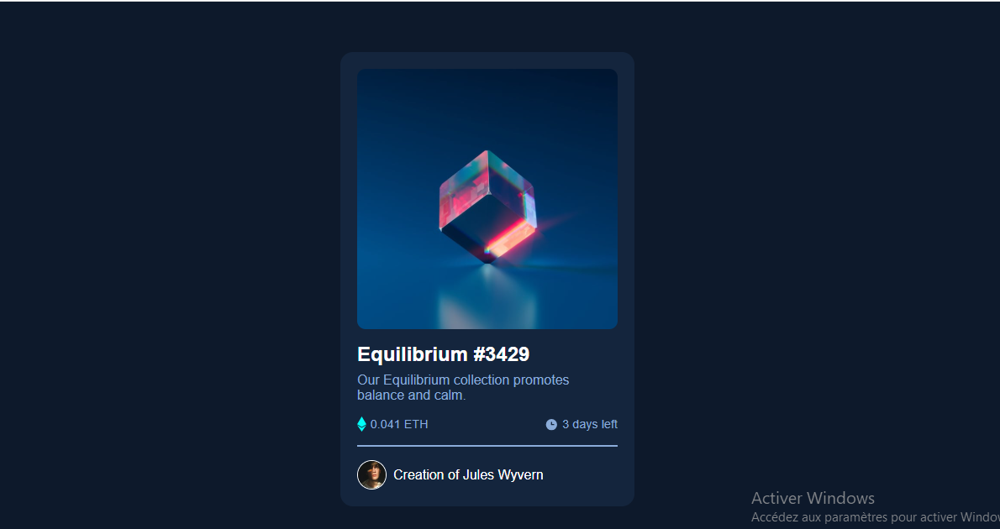

# NFT Preview Card Component

A responsive NFT card component challenge from Frontend Mentor.  
This project reproduces exactly the provided design, including the hover effect on the image and a layout adapted for mobile and desktop.

## Table of Contents
- [Overview](#overview)
- [Preview](#preview)
- [Features](#features)
- [Installation](#installation)
- [Issues Workflow](#issuesworkflow)
- [Deployment](#deployment)
- [Author](#author)

## Overview
This project is part of the Frontend Mentor challenges. The goal is to build a NFT card **identical to the provided design**, using **HTML and CSS only**.  
The design includes:  
- NFT image with hover overlay  
- Title and description  
- Price (ETH) and time left information  
- Creator section with avatar  
- Responsive layout for mobile and desktop

## Preview


## Features
- Full HTML structure for the NFT card  
- CSS styling matching the challenge design  
- Hover effect on the image with overlay and “view” icon  
- Display of price (ETH) and remaining time  
- Creator section with avatar and name  
- Mobile-first responsive layout

## Installation
1. Clone the repository:  
```bash```
git clone https://github.com/your-username/nft-preview-card.git

## Issues Workflow

This project was completed following 5 main issues:

### Issue 1: Project Setup
**Description:**  
Initial setup of the project folder, HTML and CSS files, images, and README. GitHub repository initialized.

### Issue 2: Build HTML structure for NFT card
**Description:**  
Added the full HTML structure for the NFT card:
- NFT image with overlay placeholder
- Title and description
- Price and time left
- Creator section with avatar

### Issue 3: Style NFT card with CSS
**Description:**  
Added CSS styling to match the challenge design:
- Colors, fonts, layout, and spacing
- Price, time info, and creator section
- Responsive design for mobile and desktop

### Issue 4: Add hover interaction to NFT image
**Description:**  
Added hover effect on the NFT image:
- Overlay with cyan color appears
- “View” icon shows on hover
- Interaction only with CSS, no JavaScript

### Issue 5: Final touches and deployment
**Description:**  
Checked all images and paths, updated README, verified responsiveness, and deployed the project on GitHub Pages.
## Deployment
- The project is deployed using GitHub Pages: [Live Demo](https://freedev-group.github.io/htnft-preview-card-component-by-douard-/)

## Author
- Your Name / GitHub: [edouardkne](https://github.com/edouardkne)  
- Inspired by the NFT Preview Card challenge on Frontend Mentor: [Challenge Link](https://www.frontendmentor.io/challenges/nft-preview-card-component-SbdUL_w0U)